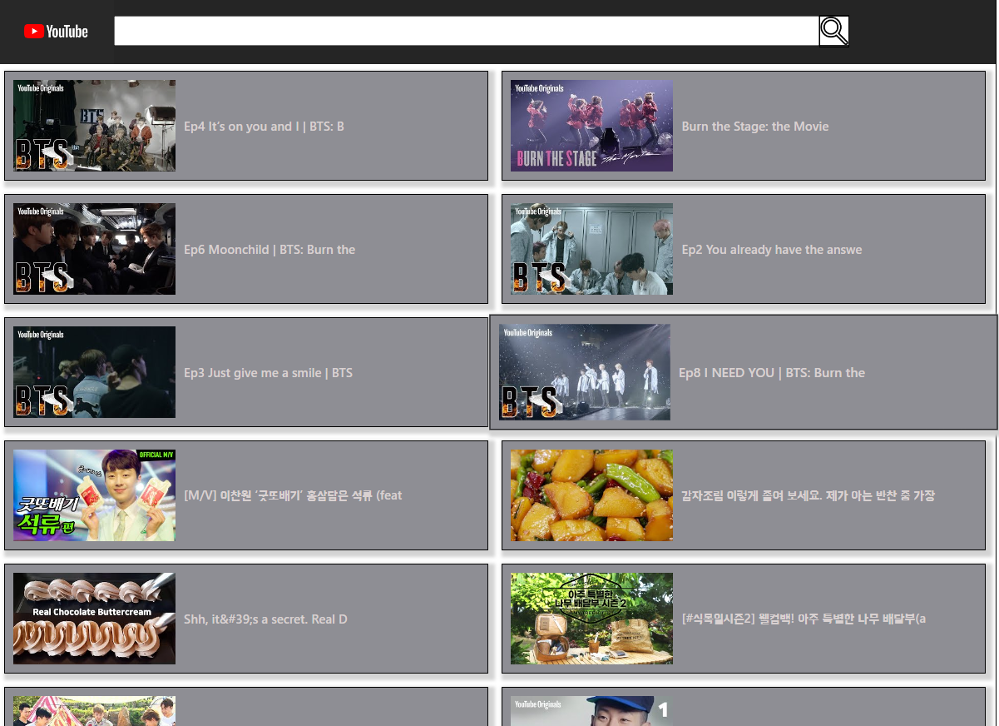
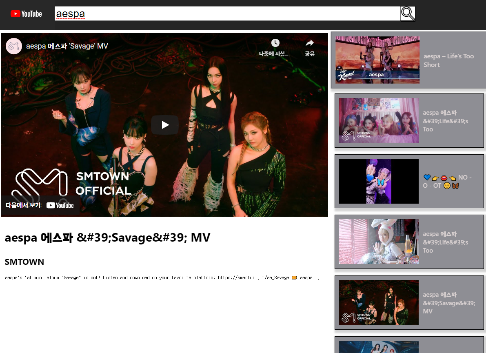
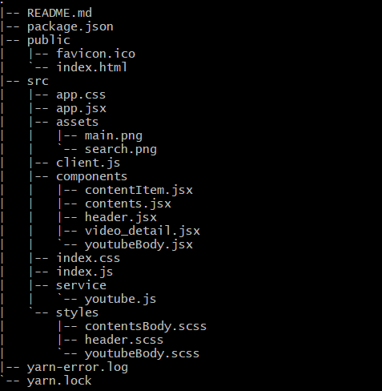

<h1># 리액트 개인 프로젝트 두번째</h1>
<h3>Msik 나만의 유튜브 제작</h3>

링크:
 

##### 구글 개발자 콘솔에서 제공해주는 api키를 받은 뒤 youtube api를 사용하여 제작하였다. 데이터의 일일 할당량이 존재하여 하루에 만개 이상의 데이터를 받으면 403에러(서버로 데이터는 전달되었지만 권한이 없어 접근 거부를 하는 에러)가 발생했다.... 태평양 기준시 자정이 되면 reset이 되는데 한국 시간으로 오후 4시였다.

## 🙋‍♀️ 프로젝트를 만들면서 배운점

### 1. dependency injection

- 의존성 주입이라는 의미로 이번 프로젝트에서는 youtube를 통해서 받아오는 데이터를 Youtube class가 있는 모듈을 따로 만들어 저장하고 실제 view로 보여주는 부분을 담당하는 youtubeBody에 props로 인스턴스만 주입하였다. 이렇게 하면서 네트워크 통신과 view만 담당하는 컴포넌트의 역할을 구분지어서 코딩할 수 있었다.
  (개인적으로 MVC, MVVM과 같이 기능에 따라 구조를 나눈 패턴의 의미를 알 수 있는 시간이었다.)

- youtubeBody라는 컴포넌트에 직접 하드코딩할 때보다 네트워크 통신부의 의존성을 낮출 수 있었다. 이는 view를 담당하는 컴포넌트 입장에서 네트워크 통신부의 내용이 변경되어도 그 의존성이 낮아 따로 내용의 변화를 줄 필요가 없었다. 어차피 전달해오는 인스턴스만 받아서 쓰면 되기 때문에 유지보수는 그 부분에서만 하면 된다. 변화에 대한 민감도를 낮출 수 있다고 생각한다.

- 네트워크 로직을 컴포넌트로부터 분리해서 더 깔끔한 코드를 작성할 수 있었다. 실전에서 유닛테스트와 같은 단위별 기능을 테스트할 때 mock라는 더미클래스(실제 기능이 아닌 흉내만 내는 객체)를 주입해서 굉장히 편하고 빠르게 테스트를 할 수 있다고 한다. 만약 컴포넌트안에 내용이 하드코딩이 되어 있었다면 보고 싶은 기능을 테스트 하려면 매번 할 때마다 네트워크 통신을 동시에 하면서 불편함을 야기할 수 있었을 것이다.

- view에 최적화된 리액트는 최대한 단순하게 한가지 기능만 수행할 수 있는 컴포넌트를 만드는 것이 좋다는 것을 느꼈다. view도 보여주고 네트워크 통신도하고 여러가지 기능을 동시에 할 수 있게 컴포넌트를 똑똑하게 만들면 프로젝트가 커질수록 유지보수와 보안에 안좋은 영향을 미치게 되는 것 같다.

---

### 2. axios와 fetch의 차이

- axios는 기본적으로 json으로 변환된 데이터를 반환해준다. fetch를 사용할 때는 그 데이터를 받은뒤 json()으로 변환해주는 과정을 거쳤었다.
- axios.create를 사용하여 baseURL을 통해 중복되는 주소를 설정하여 새로운 인스턴스를 만들 수 있다.
- axios는 주소의 parameter도 따로 params를 설정해서 만들어 기존 url주소를 나열했던 fetch에 비해 가독성을 높일 수도 있다. 경우에 따라 key와 같은 내용도 함께 params내의 설정하여 dependency를 주입해주는 class에서 조차 key의 내용을 숨겨서 사용할 수 있다.
  보안에 좀 더 신경써서 코딩을 할 수 있는 것 같다.
- 예전 브라우저는 xmlhttprequest를 사용, 최신 브라우저라면 fetch를 사용하여 다양한 브라우저에서 사용이 가능하다.

---

### 3. Sass styling

- 다양한 스타일링 방법중 sass 그 중에서 .scss를 사용해보았다.개인적으로 styled component를 사용하면서 별거 아닌 내용 때문에 변수를 하나 더 만들어야 하나라는 생각을 했었는데 그런 부분에서는 좀 더 깔끔한 스타일링이 가능했다.
- 기존 css를 사용할 때의 편안함과 동시에 더 간편한 중첩 문법과 변수를 따로 설정해서 관리할 수 있는 부분이 굉장히 맘에 들었다.
  특히 미디어 쿼리를 적용할 때 사용한 mixin과 include가 제일 유용했다고 생각한다.
- styled component를 사용하면서 파일을 따로 만들고 관리하는 것이 꽤나 번거로운 일이라고 생각했지만 그렇게 구분되어있기 때문에 오히려 유지보수가 쉽다는 생각을 했다.

#### scss 느낀점 정리

- scss는 파일을 따로 구분해서 만드는 것은 styled component에 비해 불편했다. 하지만 구분된 만큼 유지보수가 편했고 중첩문법의 깊이가 깊어질 수록 추후 유지보수가 굉장히 힘들다는 것을 깨달았다.
- 변수를 설정해서 사용할 수 있는 스타일링 문법은 미디어쿼리의 사용을 보다 효과적으로 만들어 주는 것 같다.

---

### 4. iframe태그

- 개인적으로 이번 프로젝트를 통해 처음 사용해본 태그였다. 유튜브에서 제공해주는 html페이지를 나의 html페이지 내부에 삽입할 수 있는 기능이였다. video태그와의 차이는 무엇일까 찾아서 적어봤지만 큰 차이는 없는 듯 하다. 하지만 제공처에서 iframe을 지원한다면 video로 url만을 통해 사용하는 것으로는 불가능하다.

#### video 태그와의 차이점

- video는 width or height의 크기를 비율로 지정하면 웹페이지의 크기가 달라지며 자동 조정 된다. 하지만 iframe은 폭 혹은 높이의 크기 중 하나만 비율로 설정 가능하며 둘 다 비율로 지정할 경우 먼저 입력된 걸 먼저 수행하고 이후의 크기 명령은 무시한다
  ex) width:30% height:40% 일 경우 width만 적용된다.
  따라서 width, height 중 하나는 px단위 지정되어야 하며 웹페이지의 크기가 달라지면 비율로 지정된 것만 조정됨
- iframe태그에서는 name 속성의 지원이 없어지고 있는 것 같다. 만약 사용하려면 id속성을 통해 사용하는 것을 추천한다.

---

## 기술 스택

<table>
  <tr height="130px">
    <td align="center" width="130px">
      </a>
    </td>
    <td align="center" width="130px">
      </a>
    </td>
    <td align="center" width="130px">
      </a>
    </td>
    <td align="center" width="130px">
      </a>
    </td>
    <td align="center" width="130px">
      </a>
    </td>
  </tr>
</table>

# 📁 tree

